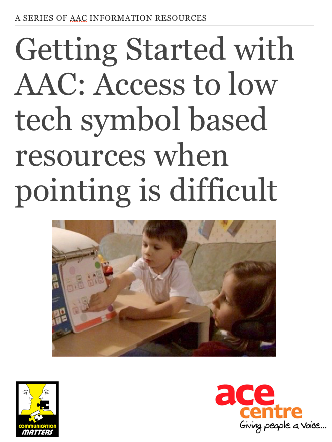

## Getting Started with AAC: Access to low tech symbol based resources when pointing is difficult

[Read Online here](/books/AdaptingLowTech/) or

 

The aim of this resource is explore access to low tech symbol based AAC when accessing standard resources is difficult physically or visually. It is aimed at people who are familiar with low tech AAC, but want to find out more about how to adjust and adapt the resources to meet individual needs.

For a more general all round introduction to low tech symbol based AAC, you could see another resource in this AAC Information Series, Getting Started with AAC: Using low tech symbol based systems with children.

While this resource is all about access to symbol based resources, it is important to also provide individuals with an alphabet chart, to enable them to explore and develop their use of letters. You can find lots more information about how to design and adapt alphabet charts in the resource, Getting Started with AAC: Designing and using alphabet charts.

Please note that this resource is not suggesting that low tech is ‘best’, or that low tech is a prerequisite to a more high tech communication aid. It is simply about valuing the role of paper based communication systems, and sharing lots of ideas and strategies to help develop and support them. You may well find that many of the ideas and strategies are useful when it comes to other forms of communication too.
